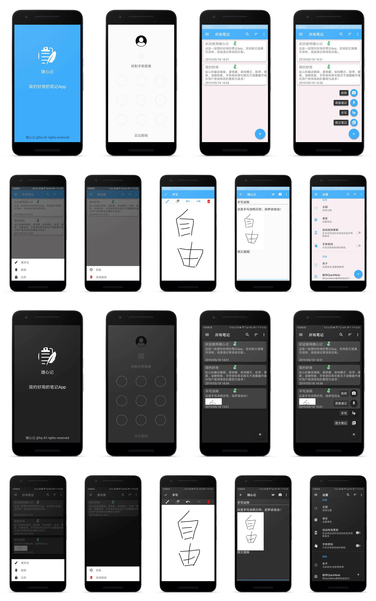

# QuickNote（随心记）

## 前言
一直想开发一个个人App，但是一方面工作太忙没时间，另一方面方向不好确定，在今年3月份的时候看到了一则关于字节跳动(今日头条母公司，下文简称头条)收购幕布的消息，当时很好奇，幕布是个什么鬼？为何头条会收购它，然后第一次了解了下幕布，是一个办公软件，下载体验了下，被其一键生成思维导图功能给吸引了，很好奇它是怎么实现的，原本想着破解它，看它的实现思路。结果发现里面大量用到了RN，说明里面的一些关键的富文本编辑功能很可能是js端实现的，仔细想想也对，幕布作为一个支持PC客户端，移动端(Android/IOS)以及Web端的办公软件，不论是从开发成本还是维护成本上来考虑，这些功能使用JS实现能够尽可能做到多端复用的效果。另一方面富文本编辑功能在JS端已经有相对成熟的框架，纯移动端实现的话一般是EditText + Span方案或者多布局方案，但这2种方案都存在一个很大的缺陷就是不够灵活，开发与维护成本高。因为核心功能是使用JS代码来实现的，所以就没破解的欲望了，但是方向却因此确定下来了就是做一个个人笔记类App，大概花了一个月的时间(主要是非工作日的碎片化时间)开发了以下这个1.0.0版本，考虑到以后可能会逐步增加更多功能以及考虑上架，因此以下开源版功能及代码做了精简

## 简约好用的笔记类App

>  这是一款简约好用的笔记App，支持图文混淆，手写涂鸦，语音速记等高级功能。贴心的最近编辑，废纸篓，夜间模式，排序，搜索，误删恢复，手势密码等功能无不透露着作者对用户使用体验的重视与追求！

## 开源版扫码下载
因平时工作较忙，正式版业余时间开发进度较慢，还未上线，可扫码体验开源版  
